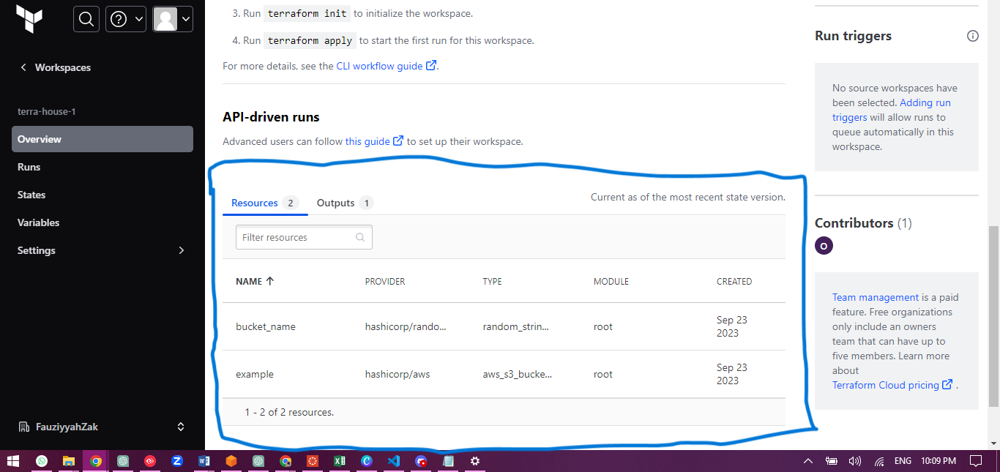

## Lesson 1
The init command only runs on fresh workspaces, not stale ones that are restarted after a short stop. Now using the 'before' key in the gitpod.yml file.

## Lesson 2
We have created a bash script in ./bin/install_terraform_cli to install terraform, and added it to tasks in the gitpod.yml file. This is because bash scripts to install Terraform are more than what was initially used, and this was noticed when fixing depracation issues.
Keeps the gitpod file tidy.

### Points to note
- This version is built against Ubuntu. Check your Linux distribution [here](https://www.cyberciti.biz/faq/how-to-check-os-version-in-linux-command-line/) and work accordingly.


# Migrating local tfstate to Terraform Cloud (TfC)
## Steps
- Launch workspace and run `terraform init`

- Run `terraform apply --auto-approve`, because we are sure of what resources would be provisioned and do not need to check at this point.

- Create a token to login to TFC at 
https://app.terraform.io/app/settings/tokens?source=terraform-login.  Ideally, running `terraform login` should work log us in to TFC. However it does not work expected in Gitpod VsCode in the browser.

- Then, create and open the file manually here:

```sh
touch /home/gitpod/.terraform.d/credentials.tfrc.json
open /home/gitpod/.terraform.d/credentials.tfrc.json
```

- Provide the following code (replace your token in the file):

```json
{
  "credentials": {
    "app.terraform.io": {
      "token": "YOUR-TERRAFORM-CLOUD-TOKEN"
    }
  }
}
``````

- Thereafter, run `terraform init` to move your state file to TFC. You should then see this in yur TF account, showing the resources and indicating that the migration has been successful.



# Automate TFC Login
